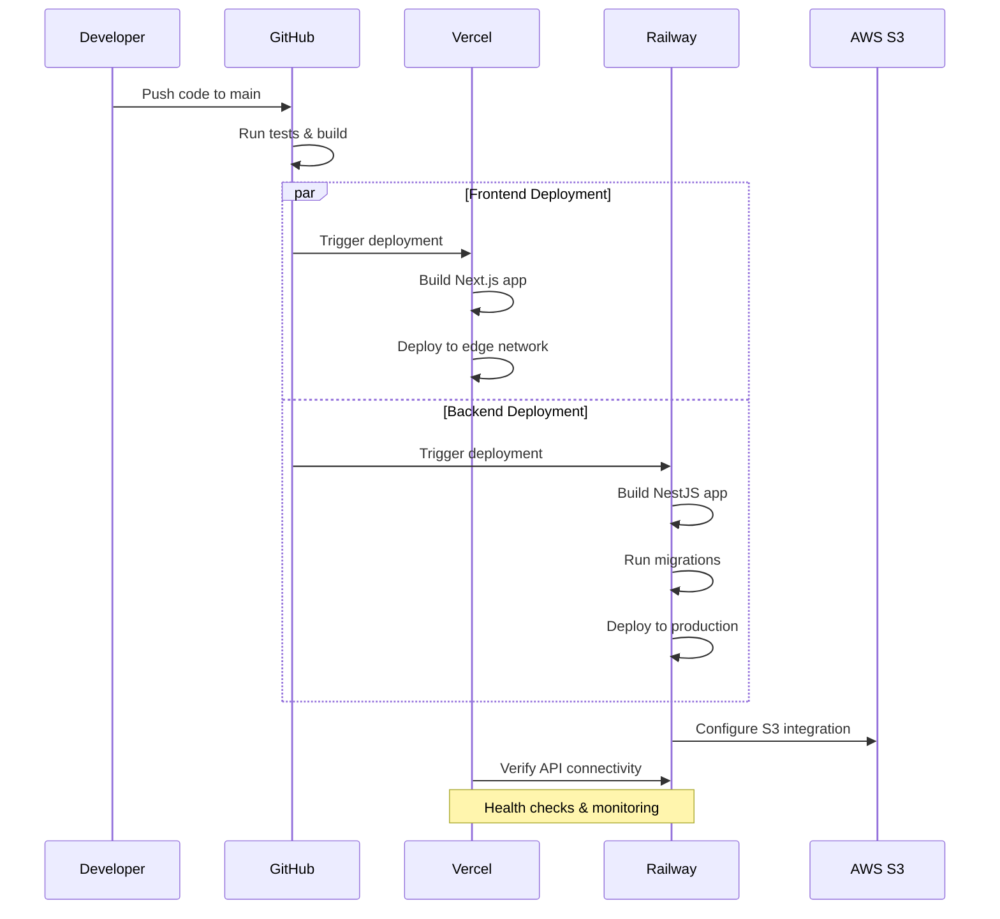

# Production Deployment Design Document

## Overview

This design document outlines the technical architecture and implementation approach for deploying IronGrid B2B Quotation & CRM Platform to production using Vercel + Railway architecture. The design ensures scalability, security, performance, and maintainability while optimizing for cost-effectiveness and developer experience.

## Architecture

### High-Level Architecture

```mermaid
graph TB
    subgraph "User Layer"
        U[Users/Browsers]
        M[Mobile Devices]
    end
    
    subgraph "CDN & DNS"
        GD[GoDaddy DNS]
        CF[Vercel Edge Network]
    end
    
    subgraph "Frontend (Vercel)"
        FE[Next.js 15 App]
        VE[Vercel Edge Functions]
        VA[Vercel Analytics]
    end
    
    subgraph "Backend (Railway)"
        BE[NestJS API]
        PG[(PostgreSQL)]
        RD[(Redis)]
        RM[Railway Monitoring]
    end
    
    subgraph "File Storage (AWS)"
        S3[S3 Bucket]
        CF2[CloudFront CDN]
    end
    
    subgraph "External Services"
        SG[SendGrid Email]
        ST[Sentry Monitoring]
    end
    
    U --> GD
    M --> GD
    GD --> CF
    CF --> FE
    FE --> VE
    FE --> BE
    BE --> PG
    BE --> RD
    BE --> S3
    BE --> SG
    FE --> ST
    BE --> ST
    S3 --> CF2
    
    style FE fill:#0070f3
    style BE fill:#0f172a
    style PG fill:#336791
    style RD fill:#dc382d
    style S3 fill:#ff9900
```



### Deployment Flow



## Components and Interfaces

### 1. Frontend Architecture (Vercel)

#### Component Structure
```typescript
// Frontend deployment configuration
interface VercelConfig {
  framework: 'nextjs';
  buildCommand: 'npm run build';
  outputDirectory: '.next';
  installCommand: 'npm ci';
  devCommand: 'npm run dev';
  
  // Environment variables
  env: {
    NEXT_PUBLIC_API_BASE_URL: string;
    NEXT_PUBLIC_APP_VERSION: string;
    NEXT_PUBLIC_ENVIRONMENT: 'production';
  };
  
  // Performance optimizations
  functions: {
    'app/**': {
      maxDuration: 30;
    };
  };
  
  // Security headers
  headers: SecurityHeader[];
}
```

#### Build Optimization
- **Turbopack**: Enabled for faster builds
- **Image Optimization**: Automatic WebP conversion and responsive images
- **Code Splitting**: Automatic route-based code splitting
- **Edge Functions**: API routes deployed to edge locations
- **Static Generation**: Pre-rendered pages where possible

#### Performance Configuration
```typescript
// Next.js production configuration
const nextConfig = {
  experimental: {
    turbo: true,
  },
  images: {
    domains: ['your-s3-bucket.s3.amazonaws.com'],
    formats: ['image/webp', 'image/avif'],
  },
  compress: true,
  poweredByHeader: false,
  generateEtags: false,
};
```

### 2. Backend Architecture (Railway)

#### Service Configuration
```typescript
// Railway deployment configuration
interface RailwayConfig {
  build: {
    builder: 'NIXPACKS';
    buildCommand: 'npm ci && npm run build';
    startCommand: 'npm run start:prod';
  };
  
  deploy: {
    healthcheckPath: '/api/health';
    healthcheckTimeout: 100;
    restartPolicyType: 'ON_FAILURE';
    restartPolicyMaxRetries: 10;
  };
  
  services: {
    postgres: PostgreSQLConfig;
    redis: RedisConfig;
  };
}
```

#### Database Configuration
```typescript
// Production database configuration
interface DatabaseConfig {
  url: string; // Railway managed PostgreSQL URL
  ssl: {
    rejectUnauthorized: false; // Required for Railway
  };
  pool: {
    min: 5;
    max: 20;
    idleTimeoutMillis: 30000;
    connectionTimeoutMillis: 10000;
  };
  logging: boolean; // Enabled for slow query detection
}
```

#### Redis Configuration
```typescript
// Production Redis configuration
interface RedisConfig {
  url: string; // Railway managed Redis URL
  retryDelayOnFailover: 100;
  enableReadyCheck: true;
  maxRetriesPerRequest: 3;
  lazyConnect: true;
  keepAlive: 30000;
}
```

### 3. File Storage Architecture (AWS S3)

#### S3 Service Design
```typescript
// S3 service implementation
class S3Service {
  private s3Client: S3;
  private bucketName: string;
  
  constructor(config: S3Config) {
    this.s3Client = new S3({
      accessKeyId: config.accessKeyId,
      secretAccessKey: config.secretAccessKey,
      region: config.region,
    });
    this.bucketName = config.bucketName;
  }
  
  async uploadFile(file: FileUpload): Promise<FileResult> {
    // Implementation with error handling and validation
  }
  
  async deleteFile(fileUrl: string): Promise<void> {
    // Implementation with proper cleanup
  }
  
  async getSignedUrl(key: string, expiresIn: number): Promise<string> {
    // Implementation for secure file access
  }
}
```

#### CORS Configuration
```json
{
  "CORSRules": [
    {
      "AllowedOrigins": [
        "https://app.yourdomain.com",
        "https://your-project.vercel.app"
      ],
      "AllowedMethods": ["GET", "POST", "PUT", "DELETE"],
      "AllowedHeaders": ["*"],
      "MaxAgeSeconds": 3000
    }
  ]
}
```

### 4. CI/CD Pipeline Architecture

#### GitHub Actions Workflow
```yaml
# Backend deployment workflow
name: Deploy Backend
on:
  push:
    branches: [main]
    paths: ['backend/**']

jobs:
  test:
    runs-on: ubuntu-latest
    services:
      postgres:
        image: postgres:15
        env:
          POSTGRES_PASSWORD: test
        options: >-
          --health-cmd pg_isready
          --health-interval 10s
          --health-timeout 5s
          --health-retries 5
    
    steps:
      - uses: actions/checkout@v4
      - uses: actions/setup-node@v4
        with:
          node-version: '18'
          cache: 'npm'
      
      - name: Install dependencies
        run: cd backend && npm ci
      
      - name: Run tests
        run: cd backend && npm run test:ci
      
      - name: Run E2E tests
        run: cd backend && npm run test:e2e

  deploy:
    needs: test
    if: github.ref == 'refs/heads/main'
    runs-on: ubuntu-latest
    
    steps:
      - uses: actions/checkout@v4
      - name: Deploy to Railway
        uses: railway-app/railway-action@v1
        with:
          api-token: ${{ secrets.RAILWAY_TOKEN }}
          project-id: ${{ secrets.RAILWAY_PROJECT_ID }}
```

## Data Models

### Environment Configuration Model
```typescript
// Production environment configuration
interface ProductionEnvironment {
  // Application settings
  nodeEnv: 'production';
  port: number;
  
  // Database configuration
  databaseUrl: string;
  dbPoolMin: number;
  dbPoolMax: number;
  
  // Redis configuration
  redisUrl: string;
  
  // Security settings
  jwtAccessSecret: string;
  jwtRefreshSecret: string;
  allowedOrigins: string[];
  cookieDomain: string;
  cookieSecure: boolean;
  sameSite: 'none' | 'strict' | 'lax';
  
  // File storage
  awsAccessKeyId?: string;
  awsSecretAccessKey?: string;
  awsRegion?: string;
  awsS3Bucket?: string;
  
  // Email service
  sendgridApiKey?: string;
  fromEmail?: string;
  
  // Monitoring
  sentryDsn?: string;
  enableMetrics: boolean;
  logLevel: 'error' | 'warn' | 'info' | 'debug';
}
```

### Deployment Status Model
```typescript
// Deployment tracking model
interface DeploymentStatus {
  id: string;
  environment: 'production' | 'staging';
  version: string;
  commitHash: string;
  deployedAt: Date;
  deployedBy: string;
  
  services: {
    frontend: ServiceStatus;
    backend: ServiceStatus;
    database: ServiceStatus;
    redis: ServiceStatus;
    fileStorage: ServiceStatus;
  };
  
  healthChecks: HealthCheck[];
  rollbackAvailable: boolean;
}

interface ServiceStatus {
  status: 'healthy' | 'unhealthy' | 'deploying';
  url?: string;
  lastChecked: Date;
  responseTime?: number;
  errorMessage?: string;
}
```

## Error Handling

### Deployment Error Handling
```typescript
// Deployment error handling strategy
class DeploymentErrorHandler {
  async handleDeploymentFailure(error: DeploymentError): Promise<void> {
    // Log error details
    await this.logError(error);
    
    // Notify team
    await this.notifyTeam(error);
    
    // Attempt rollback if safe
    if (error.severity === 'critical' && this.canRollback()) {
      await this.initiateRollback();
    }
    
    // Update deployment status
    await this.updateDeploymentStatus('failed', error);
  }
  
  async handleHealthCheckFailure(service: string): Promise<void> {
    // Retry health check
    const retryResult = await this.retryHealthCheck(service);
    
    if (!retryResult.success) {
      // Escalate to manual intervention
      await this.escalateToTeam(service, retryResult.error);
    }
  }
}
```

### Runtime Error Handling
```typescript
// Production error handling
class ProductionErrorHandler {
  async handleApiError(error: Error, context: RequestContext): Promise<void> {
    // Sanitize error for client
    const clientError = this.sanitizeError(error);
    
    // Log full error details
    await this.logError(error, context);
    
    // Send to monitoring service
    if (this.shouldReportError(error)) {
      await this.reportToSentry(error, context);
    }
    
    // Check if error indicates system issue
    if (this.isSystemError(error)) {
      await this.triggerAlert(error);
    }
  }
}
```

## Testing Strategy

### Pre-Deployment Testing
```typescript
// Testing pipeline configuration
interface TestingPipeline {
  unit: {
    coverage: {
      branches: 90;
      functions: 90;
      lines: 90;
      statements: 90;
    };
    timeout: 30000;
  };
  
  integration: {
    database: boolean;
    redis: boolean;
    externalApis: boolean;
  };
  
  e2e: {
    scenarios: E2EScenario[];
    browsers: ['chrome', 'firefox'];
    devices: ['desktop', 'mobile'];
  };
  
  performance: {
    loadTesting: boolean;
    responseTimeThreshold: 200; // ms
    concurrentUsers: 100;
  };
}
```

### Post-Deployment Testing
```typescript
// Production health checks
class ProductionHealthChecker {
  async runHealthChecks(): Promise<HealthCheckResult[]> {
    const checks = [
      this.checkApiEndpoints(),
      this.checkDatabaseConnection(),
      this.checkRedisConnection(),
      this.checkFileUpload(),
      this.checkEmailService(),
      this.checkAuthenticationFlow(),
    ];
    
    return Promise.all(checks);
  }
  
  async checkApiEndpoints(): Promise<HealthCheckResult> {
    // Test critical API endpoints
    const endpoints = [
      '/api/health',
      '/api/auth/login',
      '/api/customers',
      '/api/quotations',
      '/api/products',
    ];
    
    // Implementation
  }
}
```

### Monitoring and Alerting
```typescript
// Monitoring configuration
interface MonitoringConfig {
  metrics: {
    responseTime: {
      threshold: 200; // ms
      alertAfter: 5; // consecutive failures
    };
    errorRate: {
      threshold: 1; // percent
      window: 300; // seconds
    };
    uptime: {
      threshold: 99.9; // percent
      window: 3600; // seconds
    };
  };
  
  alerts: {
    email: string[];
    slack?: string;
    pagerDuty?: string;
  };
  
  dashboards: {
    railway: boolean;
    vercel: boolean;
    sentry: boolean;
    custom: boolean;
  };
}
```

## Security Architecture

### Authentication & Authorization
```typescript
// Production security configuration
interface SecurityConfig {
  jwt: {
    accessTokenExpiry: '15m';
    refreshTokenExpiry: '7d';
    algorithm: 'HS256';
    issuer: 'irongrid-api';
  };
  
  cors: {
    origin: string[];
    credentials: true;
    methods: ['GET', 'POST', 'PUT', 'DELETE', 'PATCH'];
    allowedHeaders: ['Content-Type', 'Authorization'];
  };
  
  rateLimit: {
    windowMs: 900000; // 15 minutes
    maxRequests: 100;
    skipSuccessfulRequests: false;
  };
  
  helmet: {
    contentSecurityPolicy: CSPConfig;
    hsts: HSTSConfig;
    noSniff: true;
    xssFilter: true;
  };
}
```

### File Upload Security
```typescript
// Secure file upload configuration
interface FileUploadSecurity {
  allowedMimeTypes: string[];
  maxFileSize: number; // bytes
  virusScanning: boolean;
  
  validation: {
    imageTypes: ['image/jpeg', 'image/png', 'image/webp'];
    documentTypes: ['application/pdf', 'text/plain'];
    maxDimensions: { width: 4096; height: 4096 };
  };
  
  storage: {
    encryption: 'AES256';
    accessControl: 'public-read';
    lifecycle: {
      deleteAfterDays: 365;
    };
  };
}
```

## Performance Optimization

### Caching Strategy
```typescript
// Multi-layer caching design
interface CachingStrategy {
  levels: {
    cdn: {
      provider: 'vercel' | 'cloudfront';
      ttl: 86400; // 24 hours for static assets
    };
    
    application: {
      provider: 'redis';
      strategies: {
        apiResponses: { ttl: 300 }; // 5 minutes
        userSessions: { ttl: 3600 }; // 1 hour
        productCatalog: { ttl: 7200 }; // 2 hours
      };
    };
    
    database: {
      queryCache: boolean;
      connectionPool: {
        min: 5;
        max: 20;
        idleTimeout: 30000;
      };
    };
  };
}
```

### Database Optimization
```typescript
// Database performance configuration
interface DatabaseOptimization {
  indexes: {
    customers: ['email', 'company_name'];
    quotations: ['customer_id', 'created_at', 'status'];
    products: ['category', 'name', 'active'];
    users: ['email', 'role'];
  };
  
  queries: {
    slowQueryThreshold: 1000; // ms
    logSlowQueries: true;
    enableQueryCache: true;
  };
  
  maintenance: {
    autoVacuum: true;
    analyzeThreshold: 0.1;
    vacuumThreshold: 0.2;
  };
}
```

This design document provides a comprehensive technical blueprint for implementing the production deployment. The architecture ensures scalability, security, and maintainability while optimizing for the specific requirements of the IronGrid B2B platform.