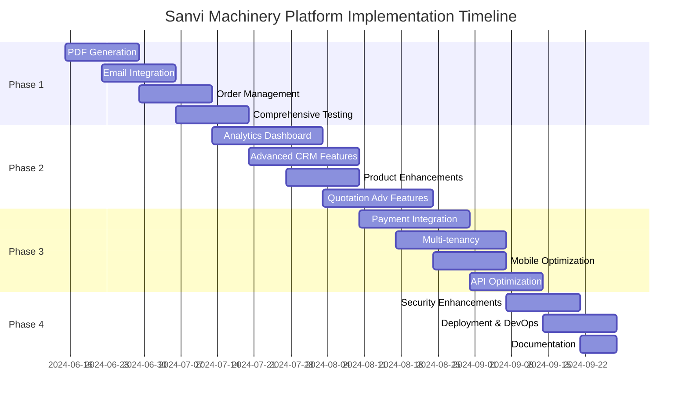

# Sanvi Machinery B2B Quotation & CRM Platform - Implementation Plan

## Executive Summary

This document outlines the remaining implementation tasks for the Sanvi Machinery B2B Quotation & CRM Platform. The plan is organized by system component and prioritized based on business impact and technical dependencies. It provides a clear roadmap for completing the platform development.

## Implementation Status Overview

### Completed Features

1. **Core System Architecture**
   - ✅ PostgreSQL database with complete schema via Prisma ORM
   - ✅ NestJS backend with modular architecture
   - ✅ Next.js 15.5 frontend with React 19.1
   - ✅ Project structure and core dependencies

2. **Authentication & Security**
   - ✅ JWT-based authentication system
   - ✅ Role-based access control (RBAC) structure
   - ✅ Login/logout functionality
   - ✅ Basic password security

3. **Customer Management**
   - ✅ Customer CRUD operations API
   - ✅ Customer listing and details UI
   - ✅ Basic customer profile management

4. **Product Management**
   - ✅ Product catalog data structure
   - ✅ Basic product CRUD operations
   - ✅ Product listing UI

5. **Quotation System (Core)**
   - ✅ Quotation data model with line items
   - ✅ Basic quotation CRUD operations
   - ✅ Quotation form UI with multi-step process
   - ✅ Controller structure for PDF generation

## Remaining Features (Prioritized)

### Phase 1: Core Functionality Completion (2-3 weeks)

#### 1. PDF Generation System
- **Priority: High**
- **Status: Partially Implemented**
- **Tasks:**
  - [ ] Complete PDF template design with company branding
  - [ ] Implement HTML to PDF conversion using Puppeteer
  - [ ] Add dynamic content insertion for quotation details
  - [ ] Create header/footer templates
  - [ ] Implement file storage integration for generated PDFs
  - [ ] Add PDF preview functionality in frontend
  - [ ] Ensure PDF design is responsive and professional
  - [ ] Add support for optional company logo inclusion

#### 2. Email Integration System
- **Priority: High**
- **Status: Structure Created, Implementation Needed**
- **Tasks:**
  - [ ] Complete SendGrid integration for email delivery
  - [ ] Create email templates for quotation sending
  - [ ] Implement email tracking (open/click)
  - [ ] Add email history to customer profiles
  - [ ] Create email scheduling functionality
  - [ ] Implement bulk email capabilities
  - [ ] Add email template management in admin UI

#### 3. Order Management
- **Priority: High**
- **Status: Model Created, Implementation Needed**
- **Tasks:**
  - [ ] Complete order creation from approved quotations
  - [ ] Implement order status workflow
  - [ ] Create order detail views
  - [ ] Add order history to customer profiles
  - [ ] Implement order filtering and search
  - [ ] Add order modification functionality
  - [ ] Create order summary reports

#### 4. Comprehensive Testing
- **Priority: High**
- **Status: Initial Setup Only**
- **Tasks:**
  - [ ] Implement unit tests for core backend services
  - [ ] Add integration tests for API endpoints
  - [ ] Create frontend component tests
  - [ ] Implement end-to-end tests for critical workflows
  - [ ] Add test coverage reporting
  - [ ] Setup CI pipeline for automated testing

### Phase 2: Enhanced Features (3-4 weeks)

#### 5. Analytics Dashboard
- **Priority: Medium**
- **Status: Structure Created, Implementation Needed**
- **Tasks:**
  - [ ] Implement quotation conversion analytics
  - [ ] Create sales performance dashboard
  - [ ] Add customer acquisition metrics
  - [ ] Implement product performance analytics
  - [ ] Create time-series data visualization
  - [ ] Add exportable reports
  - [ ] Implement filtering and date range selection

#### 6. Advanced Customer CRM Features
- **Priority: Medium**
- **Status: Basic Structure Created**
- **Tasks:**
  - [ ] Implement customer segmentation functionality
  - [ ] Add communication history tracking
  - [ ] Create follow-up reminder system
  - [ ] Implement customer notes and activities
  - [ ] Add customer credit management
  - [ ] Create customer portal for quotation viewing
  - [ ] Implement customer tagging system

#### 7. Product Catalog Enhancements
- **Priority: Medium**
- **Status: Basic Implementation**
- **Tasks:**
  - [ ] Add product category management
  - [ ] Implement product images and gallery
  - [ ] Create product variant support
  - [ ] Add inventory tracking functionality
  - [ ] Implement product import/export
  - [ ] Create product comparison feature
  - [ ] Add product customization options

#### 8. Quotation System Advanced Features
- **Priority: Medium**
- **Status: Core Implemented, Enhancements Needed**
- **Tasks:**
  - [ ] Implement approval workflow functionality
  - [ ] Add quotation templates system
  - [ ] Create quotation versioning
  - [ ] Implement discount rules engine
  - [ ] Add customer-specific pricing
  - [ ] Create quotation expiry notifications
  - [ ] Implement bulk quotation operations

### Phase 3: System Optimization & Advanced Features (4-5 weeks)

#### 9. Payment Integration
- **Priority: Medium**
- **Status: Structure Created, Implementation Needed**
- **Tasks:**
  - [ ] Integrate Razorpay payment gateway
  - [ ] Implement payment status tracking
  - [ ] Create payment receipt generation
  - [ ] Add partial payment support
  - [ ] Implement payment reminders
  - [ ] Create refund processing
  - [ ] Add payment reporting

#### 10. Multi-tenancy & Account Management
- **Priority: Medium**
- **Status: Database Structure Ready, Implementation Needed**
- **Tasks:**
  - [ ] Implement tenant isolation
  - [ ] Create account management UI
  - [ ] Add subscription management
  - [ ] Implement tenant-specific customization
  - [ ] Create user role management per tenant
  - [ ] Add tenant data export/import functionality
  - [ ] Implement tenant onboarding workflow

#### 11. Mobile Responsiveness & Optimization
- **Priority: Medium**
- **Status: Basic Responsiveness Only**
- **Tasks:**
  - [ ] Optimize all UI components for mobile
  - [ ] Implement mobile-specific navigation
  - [ ] Create responsive data tables
  - [ ] Add offline capabilities for key features
  - [ ] Optimize image loading and rendering
  - [ ] Implement touch-friendly controls
  - [ ] Add progressive loading for large datasets

#### 12. API & Performance Optimization
- **Priority: Low**
- **Status: Basic Implementation**
- **Tasks:**
  - [ ] Implement Redis caching for frequently used data
  - [ ] Add API rate limiting
  - [ ] Create database query optimization
  - [ ] Implement bulk operations API endpoints
  - [ ] Add performance monitoring
  - [ ] Create database indexing strategy
  - [ ] Implement load testing and optimization

### Phase 4: Production Readiness (2-3 weeks)

#### 13. Security Enhancements
- **Priority: High**
- **Status: Basic Implementation**
- **Tasks:**
  - [ ] Complete MFA implementation
  - [ ] Add advanced password policies
  - [ ] Implement IP-based access controls
  - [ ] Create security audit logging
  - [ ] Add session management
  - [ ] Implement data encryption for sensitive fields
  - [ ] Create regular security scanning

#### 14. Deployment & DevOps
- **Priority: High**
- **Status: Initial Setup Only**
- **Tasks:**
  - [ ] Complete Docker containerization
  - [ ] Create production deployment scripts
  - [ ] Implement CI/CD pipeline
  - [ ] Add automated backups
  - [ ] Create environment configuration management
  - [ ] Implement monitoring and alerting
  - [ ] Add logging and error tracking

#### 15. Documentation & Knowledge Base
- **Priority: Medium**
- **Status: Minimal Documentation**
- **Tasks:**
  - [ ] Complete API documentation
  - [ ] Create user manuals for admin and customer portals
  - [ ] Add developer documentation
  - [ ] Create deployment and operations guide
  - [ ] Implement in-app help system
  - [ ] Add video tutorials for key features
  - [ ] Create troubleshooting guides

## Technical Debt & Known Issues

1. **Database Optimization**
   - Need to implement proper indexing strategy
   - Review query performance for listing operations
   - Add foreign key constraints where missing

2. **Code Quality**
   - Increase test coverage across services
   - Refactor duplicated code in frontend components
   - Add proper error handling throughout application

3. **UI/UX Improvements**
   - Standardize form validation patterns
   - Improve error message display
   - Enhance loading state indicators

## Implementation Timeline

## Success Criteria

1. **Core Platform Completeness**
   - All critical features implemented and functional
   - Backend API coverage for all business requirements
   - Frontend UI for all user workflows

2. **Quality & Performance**
   - 80%+ test coverage for critical services
   - Page load times under 2 seconds for main workflows
   - API response times under 300ms for common operations

3. **User Experience**
   - Intuitive UI with consistent design patterns
   - Responsive design for all screen sizes
   - Accessibility compliance (WCAG AA level)

## Conclusion

This implementation plan outlines the path to complete the Sanvi Machinery B2B Quotation & CRM Platform. By following this prioritized approach, the development team can focus on delivering high-impact features first while ensuring the overall system quality and performance meet business requirements.

The platform has a strong foundation with core authentication, customer management, and quotation creation features already implemented. Completing the PDF generation, email integration, and order management systems will quickly bring the platform to a minimum viable product state, after which more advanced features can be added incrementally.
